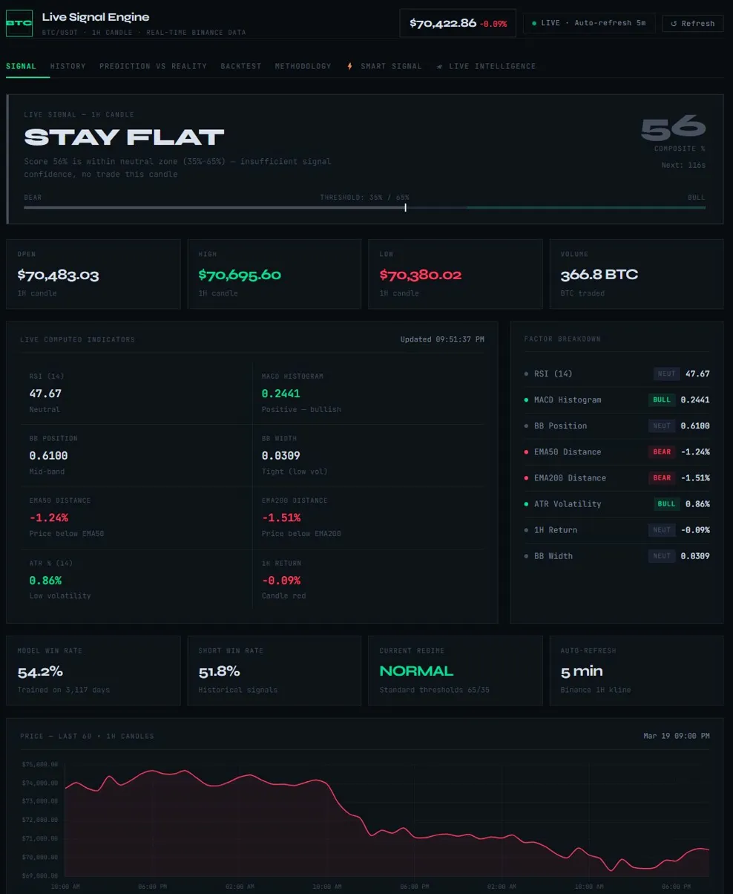
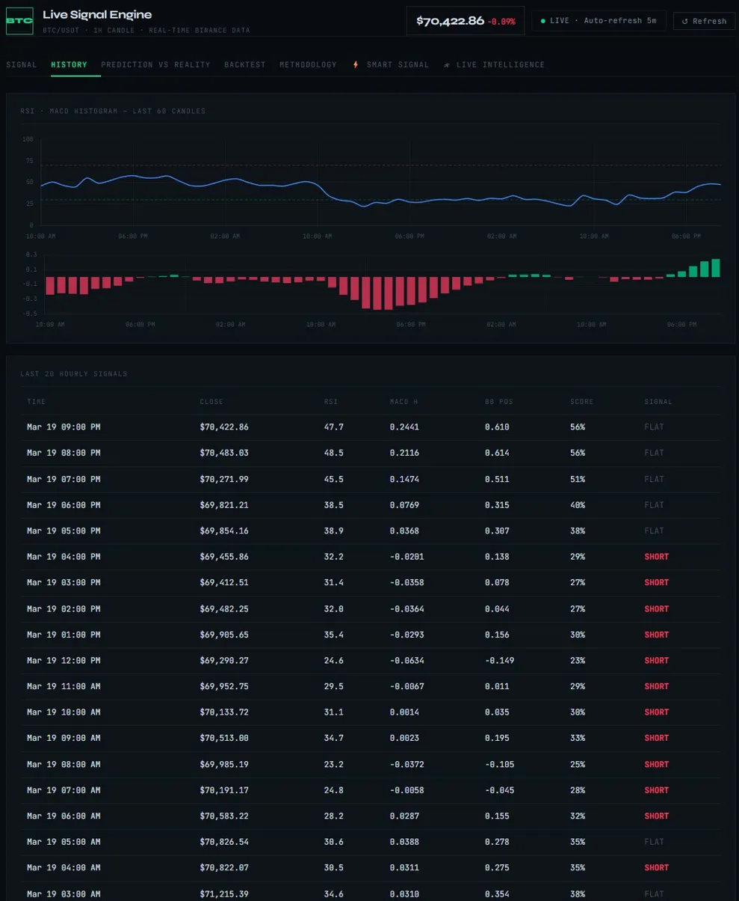
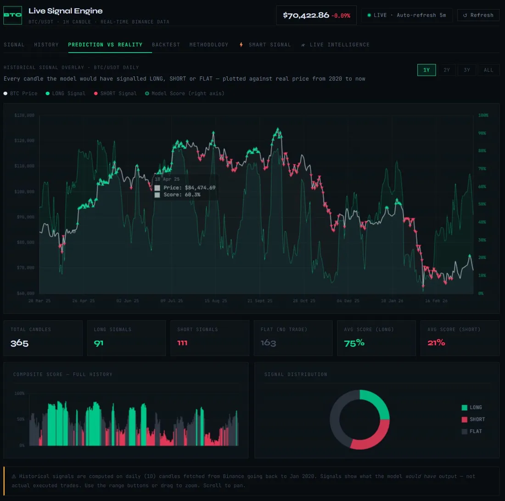
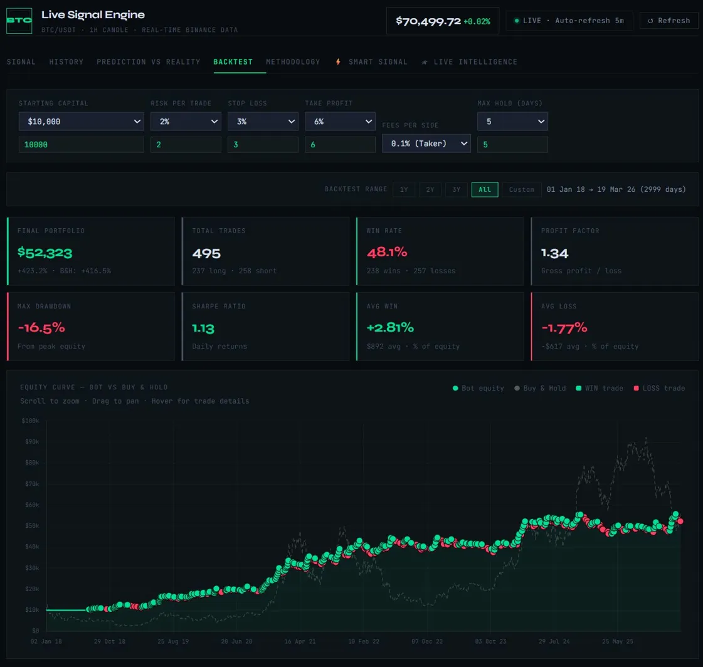
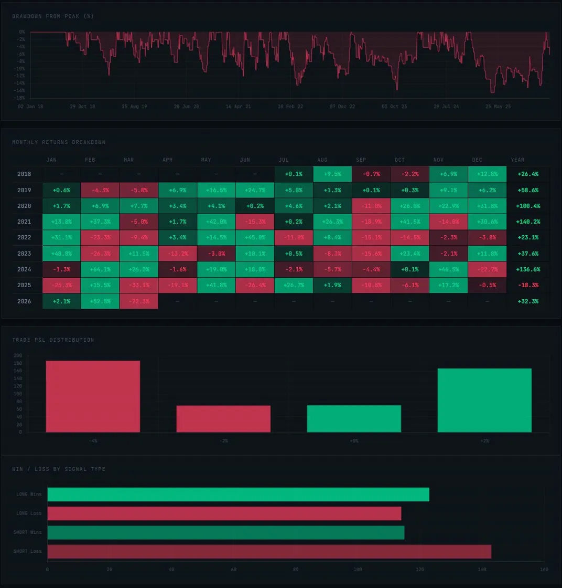
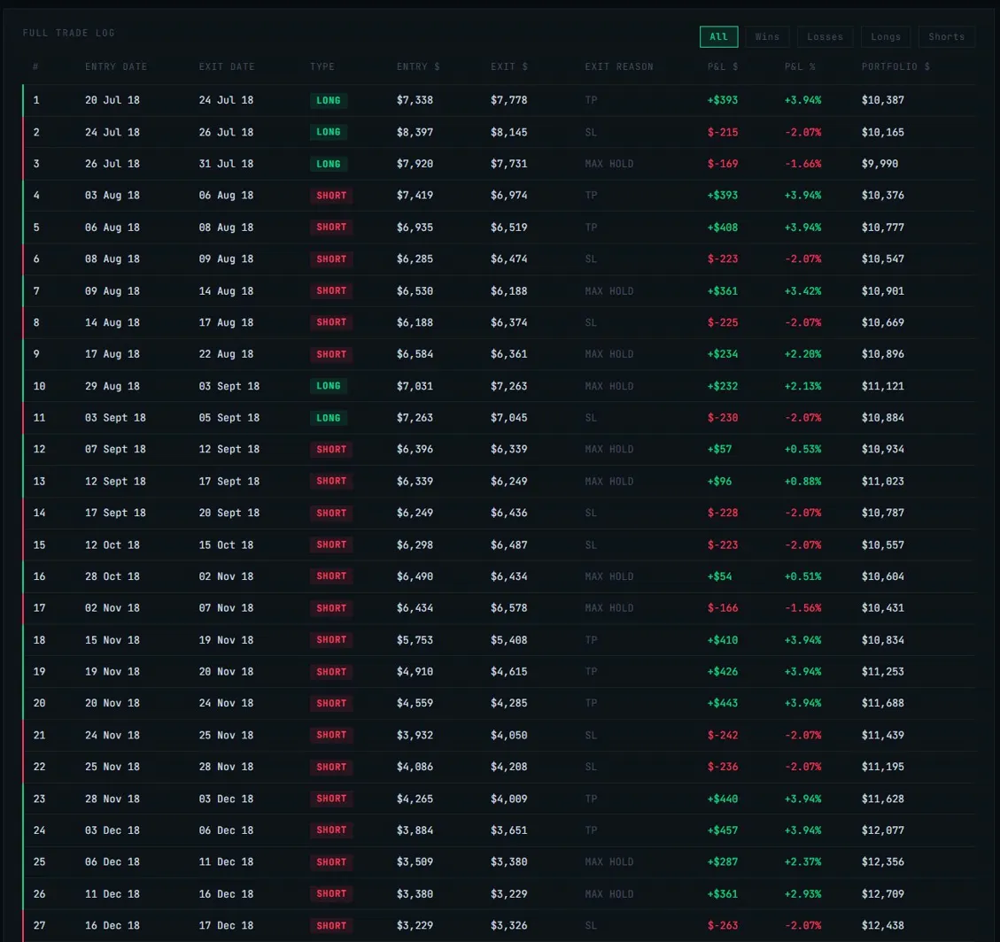
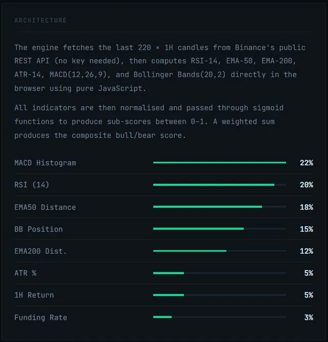
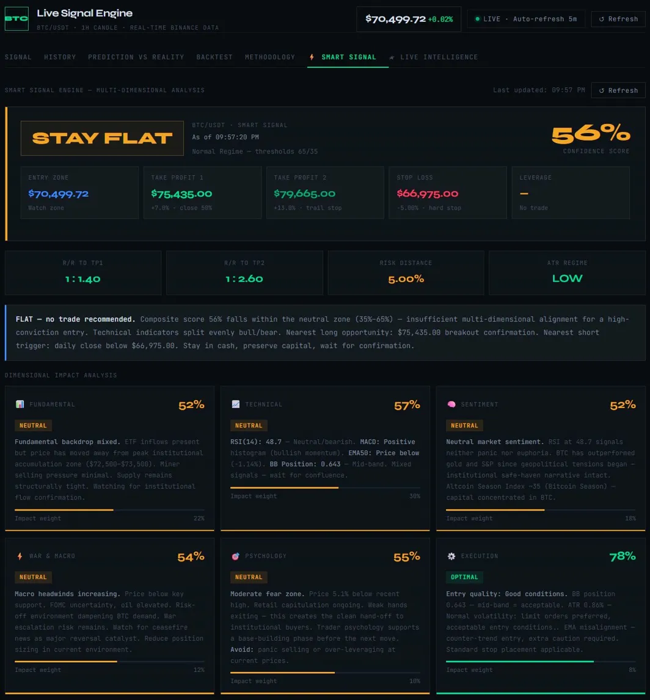
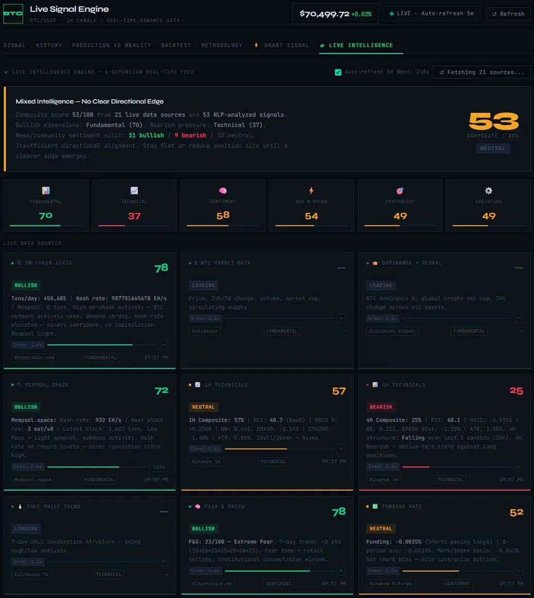
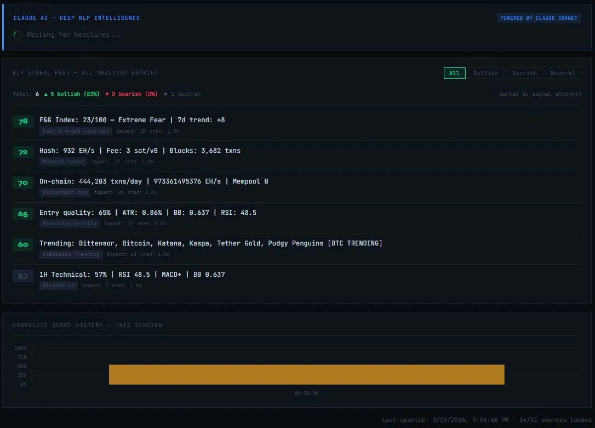

# BTC/USDT Live Signal Engine

> A full stack algorithmic trading intelligence platform for BTC/USDT that combines real time technical analysis, multi dimensional smart signals, live news NLP powered by Claude Sonnet and a fully configurable backtesting engine. Built entirely in vanilla JavaScript as a single self contained HTML file. No build step. No dependencies to install.


---

## Table of Contents

- [Overview](#overview)
- [Screenshots](#screenshots)
- [Backtest Results](#backtest-results)
- [Features](#features)
- [How It Works](#how-it-works)
  - [Signal Engine](#1-signal-engine)
  - [Smart Signal](#2-smart-signal)
  - [Live Intelligence](#3-live-intelligence)
  - [Claude Sonnet NLP](#4-claude-sonnet-nlp)
  - [Prediction vs Reality](#5-prediction-vs-reality)
  - [Backtesting Engine](#6-backtesting-engine)
  - [History Tab](#7-history-tab)
- [Tech Stack](#tech-stack)
- [Data Sources](#data-sources)
- [Setup and Usage](#setup-and-usage)
- [Configuration](#configuration)
- [Project Structure](#project-structure)
- [Disclaimer](#disclaimer)

---

## Overview

The BTC/USDT Live Signal Engine fetches live 1 hour candle data from Binance every 5 minutes and runs it through a multi layered analysis pipeline:

1. **Core signal** — an 8 factor sigmoid weighted composite score that outputs LONG, SHORT or FLAT
2. **Smart Signal** — a 6 dimensional weighted model covering fundamental, technical, sentiment, macro, psychology and execution quality
3. **Live Intelligence** — 21 external data sources aggregated in real time and each credibility weighted
4. **Claude Sonnet NLP** — Anthropic's Claude Sonnet is called asynchronously to perform deep semantic analysis of live news headlines and return structured trading implications as JSON
5. **Backtester** — a fully configurable engine that replays all signals from January 2018 to the present against real Binance OHLC data

Everything runs in a single `.html` file with no server, no build toolchain and no installed packages.

---

## Screenshots

### Signal Tab

> The main dashboard. Shows the live LONG / SHORT / FLAT signal for the current 1H candle, composite score (0 to 100%), bear/bull threshold bar, live OHLC data, all 8 computed indicators with BULL/BEAR/NEUT tags, factor breakdown panel, model win rate, current volatility regime and a 60 candle price chart. Auto refreshes every 5 minutes from Binance.

---

### History Tab

> 60 candle RSI and MACD Histogram charts with reference lines plus a table of the last 20 hourly signals showing timestamp, close price, RSI, MACD H, BB position, composite score and the signal generated. Useful for reviewing recent signal consistency and momentum shifts.

---

### Prediction vs Reality

> Historical signal overlay plotted against real BTC/USDT daily price from March 2020 to present. Green dots are LONG signals, red dots are SHORT signals, the white line is BTC price and teal bars are the model composite score on the right axis. Supports 1Y / 2Y / 3Y / ALL ranges and is draggable and zoomable. Over 1 year: 91 LONG signals, 111 SHORT signals, 163 FLAT, average LONG score 75% and average SHORT score 21%.

---

### Backtest Summary and Equity Curve

> Fully configurable backtesting engine. Default config: $10,000 starting capital, 2% risk per trade, 3% stop loss, 6% take profit, 0.1% fees per side and 5 day max hold. Tested across 2,999 days (Jan 2018 to Mar 2026). Final portfolio: **$52,323 (+423.2%)** vs Buy and Hold +416.5%. 495 total trades (237 long and 258 short), 48.1% win rate, 1.34 profit factor, 1.13 Sharpe ratio and -16.5% max drawdown. Equity curve shows bot vs buy and hold with WIN/LOSS trade markers.

---

### Backtest Monthly Returns and Drawdown

> Drawdown from peak chart (full 8 year period, max -16.5%), monthly returns heatmap by year and month, trade P&L distribution histogram and win/loss count broken down by signal type (Long Wins, Long Losses, Short Wins and Short Losses).

---

### Backtest Full Trade Log

> Complete trade by trade log for all 495 trades. Each row shows trade number, entry date, exit date, direction (LONG/SHORT), entry price, exit price, exit reason (TP / SL / MAX HOLD / SIGNAL), P&L in $ and % and running portfolio value. Filterable by All / Wins / Losses / Longs / Shorts.

---

### Methodology Tab

> Explains the signal engine architecture. The engine fetches 220 x 1H candles from Binance's public REST API, computes RSI 14, EMA 50, EMA 200, ATR 14, MACD(12,26,9) and Bollinger Bands(20,2) in the browser, normalises all values through sigmoid functions and combines them into a weighted composite score. Factor weights: MACD Histogram 22%, RSI 20%, EMA50 Distance 18%, BB Position 15%, EMA200 Distance 12%, ATR 5%, 1H Return 5% and Funding Rate 3%.

---

### Smart Signal Tab

> Multi dimensional signal analysis engine. Scores 6 dimensions independently — Fundamental (52%), Technical (57%), Sentiment (52%), War and Macro (54%), Psychology (55%) and Execution (78% / Optimal) — and combines them with weighted aggregation (Technical 30%, Fundamental 22%, Sentiment 18%, Macro 12%, Psychology 10% and Execution 8%). Shows entry zone, TP1/TP2 targets, stop loss, R/R ratios, ATR regime and a generated trade rationale with step by step execution guide.

---

### Live Intelligence Tab

> Real time feed aggregating 21 external data sources across 6 dimensions. Each source card shows its live score, verdict (BULLISH/BEARISH/NEUTRAL), raw data summary, credibility weight and dimension tag. The composite Intelligence score is a credibility weighted average across all active sources. In this run: Fundamental 70 (Bullish), Technical 37 (Bearish), Sentiment 58, War and Macro 54, Psychology 49 and Execution 49. Overall composite 53/100 Neutral with 53 NLP analyzed signals, 11 bullish / 9 bearish / 33 neutral.

---

### Claude AI Deep NLP Intelligence

> Claude Sonnet is called asynchronously via the Anthropic API to perform deep semantic NLP on live news headlines. The built in NLP feed scores each source by signal strength. In this run it shows 5 bullish (83%) and 0 bearish signals from: Fear and Greed Index (78), Mempool.space hash rate (72), Blockchain.com on chain stats (70), Execution Quality (65) and CoinGecko Trending (60). The composite score history bar tracks how the intelligence score evolves over the session.

---

## Backtest Results

> Tested on real Binance OHLCV daily data from Jan 2018 to Mar 2026 (2,999 days).

### Configuration

| Parameter | Value |
|---|---|
| Starting Capital | $10,000 |
| Risk Per Trade | 2% of equity |
| Stop Loss | 3% |
| Take Profit | 6% |
| Fees Per Side | 0.1% (Taker) |
| Max Hold | 5 days |
| Data Source | Binance BTC/USDT Daily OHLCV |
| Range | 01 Jan 2018 to 19 Mar 2026 |

### Summary Stats

| Metric | Value |
|---|---|
| Final Portfolio | **$52,323** |
| Total Return | **+423.2%** |
| Buy and Hold Return | +416.5% |
| Total Trades | 495 (237 long and 258 short) |
| Win Rate | 48.1% (238 wins and 257 losses) |
| Profit Factor | **1.34** |
| Sharpe Ratio | **1.13** |
| Max Drawdown | -16.5% from peak equity |
| Avg Win | +2.81% ($892 avg) |
| Avg Loss | -1.77% ($617 avg) |
| Model Win Rate | 54.2% (trained on 3,117 days) |
| Short Win Rate | 51.8% |

### Annual Returns

| Year | Return |
|---|---|
| 2018 | +26.4% |
| 2019 | +58.6% |
| 2020 | +100.4% |
| 2021 | +140.2% |
| 2022 | +23.1% |
| 2023 | +37.6% |
| 2024 | +136.6% |
| 2025 | -18.3% |
| 2026 (Jan to Mar) | +32.3% |

### Notable Monthly Returns

| Month | Return |
|---|---|
| Feb 2026 | +52.5% |
| Nov 2024 | +46.5% |
| Jun 2022 | +45.0% |
| Jan 2023 | +48.8% |
| Apr 2021 | +42.6% |
| May 2019 | +24.7% |

### Signal Distribution (1 Year)

| Signal | Count | Avg Score |
|---|---|---|
| LONG | 91 | 75% |
| SHORT | 111 | 21% |
| FLAT | 163 | — |

> ⚠️ Past backtest performance does not guarantee future results. This is a simulation on historical data and not live executed trades.

---

## Features

| Feature | Description |
|---|---|
| Live Signal | Real time LONG / SHORT / FLAT signal on BTC/USDT 1H candle |
| 8 Factor Composite Score | RSI, MACD, Bollinger Bands, EMA50, EMA200, ATR, 1H Return and BB Width |
| Volatility Regime Switching | Auto adjusts thresholds between Normal (65/35) and High Volatility (70/30) |
| Smart Signal Engine | 6 dimensional weighted impact analysis with execution steps |
| Live Intelligence | 21 data sources across 6 dimensions all credibility weighted (0.8 to 1.5x) |
| Claude Sonnet NLP | Deep semantic headline analysis via Anthropic API with structured JSON output |
| Prediction vs Reality | Historical signal overlay on real BTC price from Jan 2020 to present |
| Backtesting Engine | Configurable capital, risk %, SL, TP, fees and max hold with full equity curve |
| History Tab | Last 20 hourly signals table and 60 candle RSI/MACD chart |
| Auto Refresh | Fetches new candle data every 5 minutes and all panels update automatically |
| Zero Dependencies | Single HTML file with no npm, no webpack and no server required |

---

## How It Works

### 1. Signal Engine

Every 5 minutes the app fetches the last 200 BTC/USDT 1H candles from the Binance REST API and computes the following indicators from scratch in JavaScript:

| Indicator | Calculation |
|---|---|
| RSI(14) | Wilder smoothing method |
| MACD Histogram | EMA(12) minus EMA(26), signal EMA(9), histogram normalised by close price |
| Bollinger Band Position | (Close minus Lower) / (Upper minus Lower), period 20 and 2 standard deviations |
| BB Width | (Upper minus Lower) / Middle — volatility squeeze detection |
| EMA50 Distance | (Close minus EMA50) / EMA50 — percentage deviation |
| EMA200 Distance | (Close minus EMA200) / EMA200 — macro trend alignment |
| ATR(14) | True Range smoothed with Wilder method expressed as % of close |
| 1H Return | (Close minus Prev Close) / Prev Close — candle momentum |

These 8 values are fed into a sigmoid weighted composite score:

```javascript
function computeScore(v) {
  let s = 0;
  s += 0.20 * sigmoid((v.rsi  - 50) * 0.08);   // RSI
  s += 0.22 * sigmoid(v.macdh * 12);             // MACD Histogram
  s += 0.15 * sigmoid((v.bb   - 0.5) * 6);       // BB Position
  s += 0.18 * sigmoid(v.ema50  * 18);             // EMA50 Distance
  s += 0.12 * sigmoid(v.ema200 * 12);             // EMA200 Distance
  s += 0.05 * sigmoid(v.ret    * 18);             // 1H Return
  s += (v.atr > 0.10) ? -0.04 : 0;               // High Vol Penalty
  return Math.max(0, Math.min(1, s));
}
```

Signal thresholds:

- **Normal regime** (ATR below 10%): LONG at 65% or above, SHORT at 35% or below, FLAT in between
- **High Volatility regime** (ATR at 10% or above): LONG at 70% or above, SHORT at 30% or below, FLAT in between

---

### 2. Smart Signal

The Smart Signal tab runs a separate 6 dimensional weighted analysis on top of the core signal, scoring each dimension 0 to 100 and combining them into a conviction weighted composite:

| Dimension | Weight | What it measures |
|---|---|---|
| Technical | 30% | Live 8 factor composite and sub signal breakdown (RSI, MACD, EMA and BB) |
| Fundamental | 22% | Price vs institutional accumulation zone, ETF demand proxy and supply context |
| Sentiment | 18% | RSI extremes as Fear/Greed proxy, funding rate and contrarian signals |
| War and Macro | 12% | Geopolitical risk, FOMC context and ATR modulated macro score |
| Psychology | 10% | Distance from recent highs, RSI divergence and retail/smart money behaviour |
| Execution | 8% | BB position quality, ATR regime and EMA alignment — entry condition rating |

Each dimension generates a score, a verdict, a written rationale and an impact weight bar. The Smart Signal also outputs entry zone, TP1 and TP2 targets, stop loss, R/R ratios and a step by step execution guide.

---

### 3. Live Intelligence

The Live Intelligence module fetches 21 external data sources simultaneously across 6 dimensions. Each source has a credibility weight (0.8 to 1.5x) used in the composite score calculation.

**Fundamental** — Blockchain.com, CoinGecko market data, CoinGecko Global dominance and Mempool.space

**Technical** — Binance 1H candles (1.5x), Binance 4H candles and CoinGecko 7d OHLC

**Sentiment** — Alternative.me Fear and Greed Index, Binance Futures funding rate and open interest

**War and Macro** — CryptoPanic aggregated news, Messari institutional intelligence (1.5x), CoinGecko 30d momentum and RSS feeds from CoinDesk, Bitcoin Magazine and CoinTelegraph

**Psychology** — Reddit r/Bitcoin, r/CryptoCurrency and r/CryptoMarkets hot posts plus CoinGecko Social

**Execution** — Binance 24h Ticker, Binance Order Book depth and live Execution Quality scoring

---

### 4. Claude Sonnet NLP

After fetching all sources the app passes all news and Reddit items to Claude Sonnet via the Anthropic Messages API. Claude returns a strict JSON object containing overall sentiment, sentiment score, bullish and bearish headline counts, top impactful headlines, dominant theme, key risks, key opportunities and a trading implication (LONG / SHORT / WAIT) with confidence level.

Claude runs asynchronously and non blocking so the rest of the UI renders immediately while the AI analysis runs in the background.

The app also runs its own built in NLP engine as a fallback using phrase level matching, token scoring with negation handling and source credibility weighting.

---

### 5. Prediction vs Reality

This tab replays every signal the model would have generated on each historical daily candle and plots it against real BTC price from January 2020 to present. Supports 1Y / 2Y / 3Y / ALL ranges and is draggable and zoomable.

> ⚠️ These are retrospective simulations. They show what the model would have signalled and not what it actually traded.

---

### 6. Backtesting Engine

The backtesting engine replays all historical signals with fully configurable parameters:

| Parameter | Default | Options |
|---|---|---|
| Starting Capital | $10,000 | Any value |
| Risk Per Trade | 2% | 0.5% to 10% |
| Stop Loss | 3% | 1% to 15% |
| Take Profit | 6% | 2% to 30% |
| Fees Per Side | 0.1% (Taker) | 0% to 0.5% |
| Max Hold (Days) | 5 | 1 to 30 |
| Backtest Range | All (Jan 2018 to present) | 1Y, 2Y, 3Y, All and Custom |

Position sizing uses true fixed fractional risk. Exit logic in priority order: Stop Loss, Take Profit, Max Hold days exceeded then opposite signal fires.

Output includes final portfolio value, win rate, profit factor, Sharpe ratio, max drawdown, equity curve vs buy and hold, monthly returns heatmap, drawdown chart, P&L distribution and full trade log.

---

### 7. History Tab

Shows the last 60 hourly candle RSI and MACD Histogram charts with reference lines plus a table of the last 20 hourly signals with all key indicator values.

---

## Tech Stack

| Layer | Technology |
|---|---|
| Language | Vanilla JavaScript (ES2020+) |
| UI | HTML5 and CSS3 (CSS variables, Grid and Flexbox) |
| Charts | Chart.js |
| Fonts | JetBrains Mono and Syne (Google Fonts) |
| Market Data | Binance REST API (no key required) |
| AI / NLP | Anthropic Claude Sonnet via Messages API |
| Crypto Data | CoinGecko Public API, Alternative.me and Messari |
| On Chain | Blockchain.com API and Mempool.space API |
| News | CryptoPanic API and RSS feeds (CoinDesk, CoinTelegraph and Bitcoin Magazine) |
| Community | Reddit JSON API |
| Derivatives | Binance Futures REST API |

---

## Data Sources

All 21 sources are free and require no API keys except the Anthropic API for Claude NLP.

| Source | Data | Credibility |
|---|---|---|
| Binance 1H / 4H | OHLCV candles and technicals | 1.5x |
| Binance Futures | Funding rate, open interest and L/S ratio | 1.4 to 1.5x |
| Binance Ticker / Depth | 24h stats and order book | 1.4 to 1.5x |
| CoinGecko | Market data, dominance, 30d momentum and social | 1.2 to 1.3x |
| Blockchain.com | On chain stats (txns, hash rate and mempool) | 1.4x |
| Mempool.space | Fee rates, block stats and hash rate | 1.4x |
| Alternative.me | Fear and Greed Index | 1.4x |
| CryptoPanic | Aggregated news (50+ sources) | 1.4x |
| Messari | Institutional intelligence | 1.5x |
| RSS (CoinDesk / CoinTelegraph / BTC Magazine) | News headlines | 1.3x |
| Reddit (r/Bitcoin, r/CryptoCurrency and r/CryptoMarkets) | Community sentiment | 0.8 to 0.9x |

---

## Setup and Usage

No installation required. No npm. No server.

### Option 1 — Open directly in browser

```bash
git clone https://github.com/BackBhone/BTC-USDT-Live-Signal-Engine.git
open btc_signal_bot.html
```

Or just double click the `.html` file.

### Option 2 — Run with a local server (recommended to avoid CORS issues)

```bash
# Python
python -m http.server 8080

# Node
npx serve .
```

Then open `http://localhost:8080/btc_signal_bot.html`

### Add your Anthropic API key

To enable the Claude Sonnet NLP feature open the file and find:

```javascript
headers: { 'Content-Type': 'application/json' }
```

Add your key:

```javascript
headers: {
  'Content-Type': 'application/json',
  'x-api-key': 'YOUR_ANTHROPIC_API_KEY',
  'anthropic-version': '2023-06-01'
}
```

Without the API key all other features work normally. The Claude NLP panel will show a fallback message and the built in keyword NLP engine stays active.

---

## Configuration

```javascript
const SYMBOL   = 'BTCUSDT';      // Trading pair
const INTERVAL = '1h';           // Candle interval
const LIMIT    = 220;            // Candles to fetch (needs 200+ for EMA200)
const REFRESH  = 5 * 60 * 1000; // Auto refresh interval (5 minutes)

const BINANCE_BASE = 'https://api.binance.com';
```

Signal thresholds adjust automatically based on the ATR regime so no manual changes are needed.

---

## Project Structure

```
btc_signal_bot.html           Single self contained file
│
├── style                     All CSS — dark theme, CSS variables and responsive grid
│
├── body                      HTML structure
│   ├── Top bar               Live price, status and refresh button
│   ├── Tab navigation        Signal / History / Prediction vs Reality / Backtest /
│   │                         Methodology / Smart Signal / Live Intelligence
│   ├── Signal tab            Decision box, OHLC, indicators, factor breakdown and chart
│   ├── History tab           RSI/MACD charts and last 20 signals table
│   ├── Prediction vs Reality Historical signal overlay chart and signal distribution
│   ├── Backtest tab          Config panel, results, equity curve, monthly returns and trade log
│   ├── Methodology tab       How the model works, factor weights and formula breakdown
│   ├── Smart Signal tab      6 dimension analysis, execution steps and trade plan
│   └── Live Intelligence tab 21 source cards, Claude NLP panel, NLP feed and score history
│
└── script                    All JavaScript
    ├── Indicator math         RSI, EMA, MACD, BB and ATR all implemented from scratch
    ├── Signal engine          computeScore(), getThresh() and sigmoid()
    ├── Fetch and render       fetchKlines(), processKlines() and renderDecision()
    ├── History rendering      renderHistoryLog() and renderHistoryCharts()
    ├── Prediction vs Reality  fetchPVRData() and renderPVRChart()
    ├── Backtest engine        runBacktest(), calcPositionSize() and renderBtEquityChart()
    ├── Smart Signal engine    computeSmartSignal() and 6 dimension scoring
    ├── Live Intelligence      SOURCES[], fetchAllSources() and aggregateDims()
    ├── NLP engine             nlpScore(), NLP_PHRASES_BULL/BEAR and NLP_BULL/BEAR_TOKENS
    └── Claude NLP             runClaudeNlpSummary() and Anthropic API call
```

---

## Disclaimer

This project is built for educational and research purposes only. It is not financial advice. Do not make trading decisions based solely on this tool. Cryptocurrency trading involves significant risk and you can lose your entire capital. Always do your own research. Past backtest performance does not guarantee future results.

---

Built by [Aung Bhone Myat](https://github.com/BackBhone)

> *Source code is private. Available for review upon request.*
